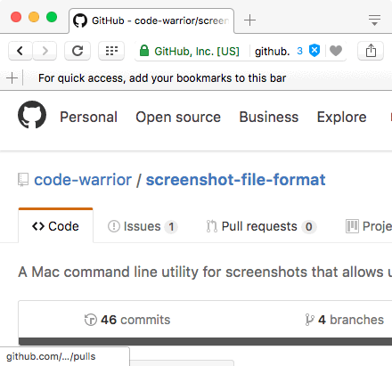

# Screenshot File Format for Mac OS X 

v1.0.3

A Mac OS X command line utility that allows users to choose between PNG, PDF, PSD, JPG, TIF, or GIF as file formats for screenshots.

## PNG

## PSD

May only show in some Markdown readers/viewers.

## PDF

May only show in some Markdown readers/viewers.

## JPG

## TIF

May only show in some Markdown readers/viewers.

## GIF

**Note**: Box shadows around screenshots were removed with the utility [screenshot-shadow](https://github.com/code-warrior/screenshot-shadow).

## Installation (Easiest)

1. Download `screenshot-file-format`:

        curl -OL https://github.com/code-warrior/screenshot-file-format/raw/master/screenshot-file-format

2. Change permissions:

        chmod 755 screenshot-file-format

3. Move the binary into your local environment:

        sudo mv screenshot-file-format /usr/local/bin

4. Run the program:

        screenshot-file-format

## Installation (Easy)

1. Download and unzip [`screenshot-file-format-master.zip`](https://github.com/code-warrior/screenshot-file-format/archive/master.zip).

2. Open The Terminal and navigate to the unzipped folder.

3. Move the binary into your local environment:

        sudo mv screenshot-shadow /usr/local/bin

4. Run `screenshot-file-format` from The Terminal:

        screenshot-file-format

## Build

### Use Make

        make

### Use GCC

        gcc -Wall main.c -ansi -pedantic -o screenshot-file-format

Linting is carried out with Splint, using flags `-unrecog` to skip over warnings in order to invoke the process open (`popen`) and process close (`pclose`) functions, and `-compdef` as a temporary measure to skip over the potential for a memory problem.

        splint main.c +skip-sys-headers -unrecog -compdef

## Verified On...

* Mac OS X 10.11
